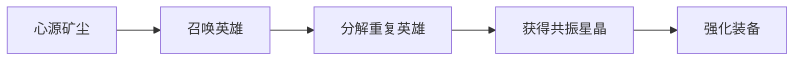

# 资源系统

掌握资源管理是在 Copper Puppetry 中取得胜利的关键。

## 💎 四大核心资源

### 1. 精炼铜锭 (Refined Copper Ingot)

<div style="padding: 1rem; border-left: 4px solid #f59e0b; background: rgba(245, 158, 11, 0.1); margin: 1rem 0;">

**最重要的战斗资源**

- 🎴 召唤铜傀英雄
- 🏗️ 建造防御建筑
- ⬆️ 某些建筑升级

</div>

#### 获取方式
- **自然恢复**：每秒自动获得固定数量
- **击败敌人**：击杀敌人掉落铜锭
- **资源建筑**：心源矿钻持续生产
- **关卡奖励**：通关后获得大量铜锭

#### 使用建议
```
初期：保守使用，优先低成本英雄
中期：建造矿钻，扩大经济
后期：全力投入，不留余地
```

---

### 2. 心源矿尘 (Heart Crystal Dust)

<div style="padding: 1rem; border-left: 4px solid #06b6d4; background: rgba(6, 182, 212, 0.1); margin: 1rem 0;">

**升级和抽卡的主要货币**

- ⬆️ 升级铜傀属性
- 🎲 英雄召唤（抽卡）
- 🔓 解锁新技能

</div>

#### 获取方式
- **通关奖励**：完成关卡主要产出
- **每日任务**：完成任务获得
- **成就系统**：达成成就奖励
- **活动副本**：特殊活动高产出

#### 使用优先级
1. 升级常用主力英雄
2. 抽取新英雄扩充卡池
3. 解锁关键技能

---

### 3. 共振星晶 (Resonant Star Crystal)

<div style="padding: 1rem; border-left: 4px solid #a855f7; background: rgba(168, 85, 247, 0.1); margin: 1rem 0;">

**装备系统的核心资源**

- 🔓 解锁装备
- ⭐ 装备升级
- 🔧 装备强化

</div>

#### 获取方式
- **困难关卡**：挑战模式高掉落
- **每周副本**：每周限定高收益
- **分解装备**：不需要的装备可分解
- **商店兑换**：使用其他资源交换

#### 推荐用途
- 优先解锁橙色品质装备
- 升级核心输出英雄的装备
- 不建议升级低品质装备

---

### 4. 灵性火花 (Spiritual Spark)

<div style="padding: 1rem; border-left: 4px solid #ef4444; background: rgba(239, 68, 68, 0.1); margin: 1rem 0;">

**稀有资源，用于高级强化**

- ⭐⭐⭐ 英雄突破（提升星级）
- 🔮 觉醒技能
- 🎁 兑换珍稀道具

</div>

#### 获取方式
- **BOSS关卡**：击败强大BOSS
- **成就奖励**：困难成就完成
- **排行奖励**：竞技场排名奖励
- **活动限定**：特殊活动产出

#### 珍贵用途
- 突破5星及以上英雄
- 觉醒S级以上技能
- 获取限定外观和特效

---

## 🔄 资源转化

某些资源可以间接转化：



### 转化效率
- 分解英雄：根据星级获得不同数量的星晶
- 分解装备：获得 30%-50% 的强化材料
- 资源商店：可以用较多的低级资源换取少量高级资源

---

## 📊 资源管理策略

### 新手期（1-10级）

**目标**：积累资源，培养核心队伍

- ✅ 专注通关主线获取心源矿尘
- ✅ 每日任务不要落下
- ✅ 选择 2-3 个主力英雄重点培养
- ❌ 不要分散资源升级太多英雄
- ❌ 不要急于抽取大量新英雄

### 成长期（11-30级）

**目标**：扩充英雄池，配齐装备

- ✅ 开始解锁和升级装备
- ✅ 培养不同职业的英雄
- ✅ 参与困难关卡刷取星晶
- ⚠️ 谨慎使用灵性火花
- ⚠️ 选择性突破英雄星级

### 成熟期（31级+）

**目标**：精益求精，追求极限

- ✅ 专注顶级装备的强化
- ✅ 突破核心英雄到满星
- ✅ 参与竞技和排行活动
- ✅ 尝试不同流派和组合

---

## 💰 资源获取日程表

### 每日必做
| 活动 | 奖励 | 时间 |
|------|------|------|
| 每日任务 | 心源矿尘 ×100 | 随时 |
| 资源本副本 | 根据需求选择 | 体力用完 |
| 商店刷新 | 购买稀有资源 | 每天3次 |

### 每周必做
| 活动 | 奖励 | 推荐度 |
|------|------|--------|
| 周常BOSS | 灵性火花 + 星晶 | ⭐⭐⭐⭐⭐ |
| 竞技场结算 | 根据排名 | ⭐⭐⭐⭐ |
| 公会任务 | 各类资源 | ⭐⭐⭐⭐ |

### 限时活动
- 节日活动：大量资源奖励
- 版本更新：新英雄免费获取
- 挑战赛：排行榜奖励

---

## 🎯 资源分配建议

### 最优分配（推荐）

```
心源矿尘分配：
- 60% 用于升级主力英雄
- 30% 用于抽取新英雄
- 10% 保留以备不时之需

共振星晶分配：
- 70% 用于核心装备升级
- 20% 用于解锁新装备
- 10% 保留应急

灵性火花分配：
- 80% 用于英雄突破
- 15% 用于觉醒技能
- 5% 保留特殊用途
```

### 常见误区

::: danger ❌ 错误做法
- 抽卡成瘾，资源全花在召唤上
- 平均培养所有英雄，没有核心队伍
- 忽视装备系统，只升级英雄等级
- 浪费灵性火花在低星英雄上
:::

::: tip ✅ 正确做法
- 理性抽卡，保证升级资源充足
- 专注培养 5-8 个核心英雄
- 装备和英雄同步强化
- 灵性火花只用于顶级资源
:::

---

## 📈 资源效率优化

### 铜锭经济学
在战斗中，铜锭的使用效率直接影响胜负：

**高效使用**：
- 前期建造矿钻（投资回报率最高）
- 根据敌人波次合理部署英雄
- 避免过度部署导致浪费

**低效使用**：
- 不看经济盲目部署高费英雄
- 忽视矿钻导致后期经济崩盘
- 建造无用建筑占用资源

### 长期规划
制定你的资源规划表：

```
短期目标（1-2周）：
- 升级主力英雄到 30 级
- 解锁 3 件核心装备
- 通关第 5 章困难模式

中期目标（1个月）：
- 至少 1 个英雄突破到 5 星
- 装备强化至 +10
- 组建 2 套不同流派队伍

长期目标（3个月）：
- 全职业满级英雄
- 顶级装备收集齐全
- 挑战最高难度内容
```

---

::: info 💡 资源管理金句
**"不要让资源在仓库里睡觉，但也不要裸奔上阵！"**

合理的资源管理既要保证当前战力提升，也要为未来发展留有余地。
:::

**下一步**：了解[升级系统](./upgrade)，让你的铜傀变得更加强大！

